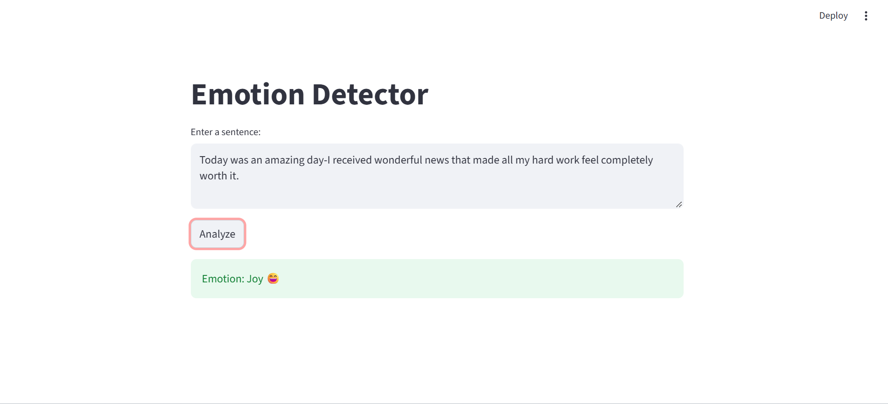

# Emotion Detector

Detects one of 6 emotions (sadness, anger, love, surprise, fear, joy) from a sentence of text.

**Live demo:** https://YOUR-APP-LINK.streamlit.app

## Tech
Python, pandas, scikit-learn, NLTK, Streamlit

## How it works
1. Cleaned the text (removed punctuation, numbers, and stopwords)
2. Converted text to numbers using TF-IDF and CountVectorizer
3. Trained Naive Bayes and Logistic Regression
4. Saved the best model and built a Streamlit app

## Results
| Model | Vectorizer | Accuracy |
|---|---|---|
| Naive Bayes | TF-IDF | 66% |
| Naive Bayes | Bag Of Words | 76% |
| Logistic Regression | TF-IDF | 86% |

## Labels
0 = sadness, 1 = anger, 2 = love, 3 = surprise, 4 = fear, 5 = joy

## Run locally
pip install -r requirements.txt
python -m streamlit run app.py

## Screenshot

